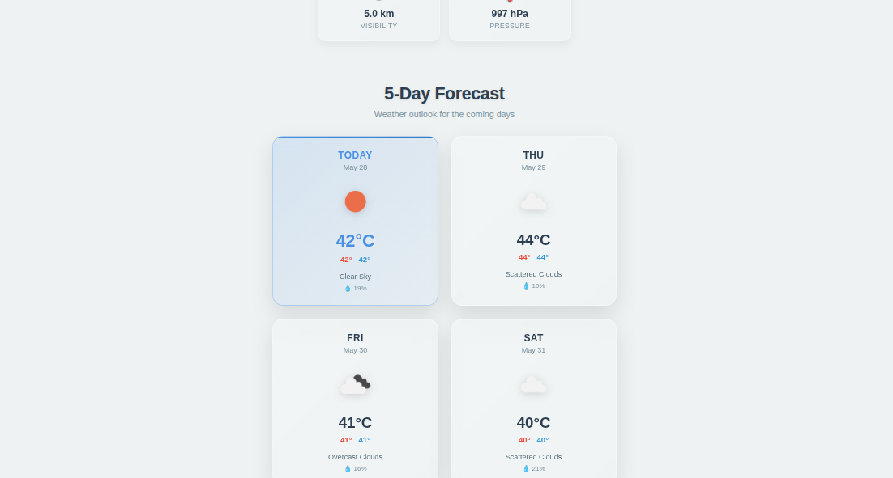
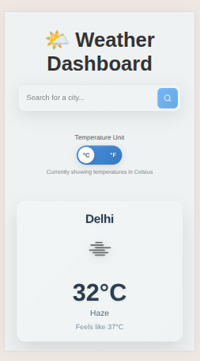
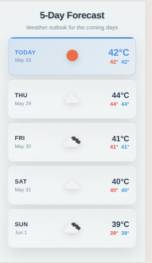

---

````md
# 🌦️ Qodex Weather Dashboard

A modern React + Vite Weather Dashboard that displays real-time weather conditions and a 5-day forecast using the OpenWeatherMap API. Built with React, Vite, and clean component architecture.

---

## 🚀 Features

- 🌍 Search weather by city name
- 📅 5-day weather forecast
- 🌡️ Toggle between Celsius and Fahrenheit
- 🔁 Real-time updates with polling
- 💾 Data persistence with localStorage
- 📱 Responsive layout

---

## 🧠 My Approach to the Assignment

I began by breaking the assignment into logical modules: user interface, weather data fetching, and shared state management. I used the Context API to handle global state for city and unit preferences and stored these in localStorage to persist data across sessions.

I ensured that both current weather and forecast data are fetched and updated automatically using polling, allowing the app to feel real-time without user refresh.

The folder structure is modular and scalable for future enhancements such as authentication, dark mode, or data caching.

---

## 🛠️ Tech Stack

- React (via Vite)
- JavaScript (ES6+)
- OpenWeatherMap API
- LocalStorage

---

## 📦 Project Setup

### 1. Clone the repository

```bash
git clone https://github.com/your-username/weather-dashboard.git
cd weather-dashboard
````

### 2. Install dependencies

```bash
npm install
```

### 3. Create `.env` file

Create a `.env` file in the root directory and add the following:

```env
VITE_WEATHER_API_KEY=your_openweathermap_key
VITE_SUPABASE_URL=your_supabase_url
VITE_SUPABASE_ANON_KEY=your_supabase_anon_key
```

> Refer to `.env.example` for the template.

### 4. Start the development server

```bash
npm run dev
```

Then open your browser and visit:
[http://localhost:5173](http://localhost:5173)

---

## 📁 Folder Structure

```
src/
WEATHER-DASHBOARD/
├── node_modules/            # Dependencies
├── public/                  # Static files
├── screenshots/             # Project screenshots for README
├── src/
│   ├── assets/              # Images, icons, etc.
│   ├── components/          # Reusable UI components
│   ├── context/             # React Context (WeatherContext)
│   ├── services/            # API services (fetchWeather, fetchForecast)
│   ├── styles/              # Global and component-specific styles
│   ├── utils/               # Utility functions (e.g., localStorage handlers)
│   ├── App.css              # Main app styling
│   ├── App.jsx              # Root App component
│   ├── index.css            # Global styles
│   └── main.jsx             # Entry point

```

---

## 🖼️ Screenshots

### 🏠 Home Page


### 🔍 City Search with Forecast



### Mobile View



### Mobile View Forecast



> *(Place your actual screenshots inside a `screenshots/` folder in the root of the repo)*

---

## 🧪 Future Improvements

* Add loading and error states
* Dark mode toggle
* Save favorite cities
* Geolocation support to detect current location automatically

---

## 📝 License

This project was developed as part of the Qodex.ai Weather Dashboard Assignment.
Use it freely for learning and non-commercial purposes.

---

```
